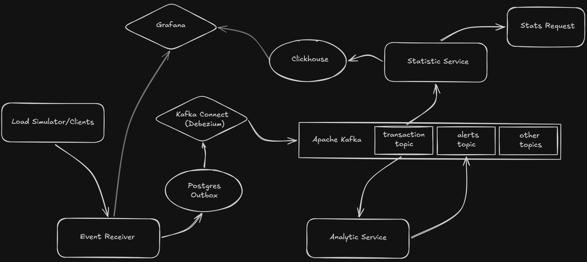
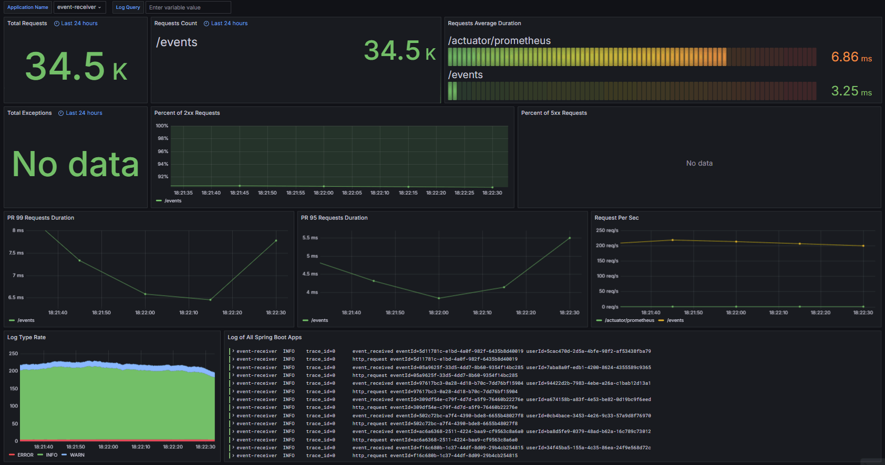
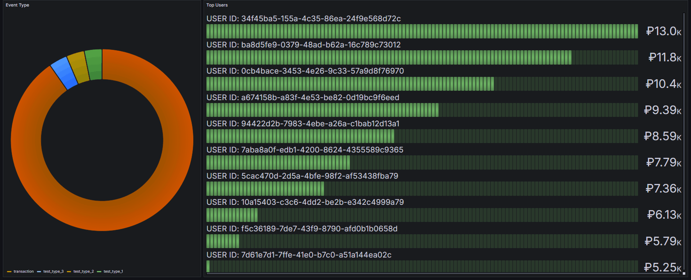

# Event-Driven Analytics System


Демонстрационный проект распределённой системы обработки событий с использованием паттерна **Transactional Outbox + CDC Debezium**, **Kafka Streams** для real-time аналитики и **ClickHouse** для хранения статистики.

## 📋 Содержание
- Архитектура
- Сервисы
- Технологии
- Мониторинг
- Быстрый старт
- Конфигурация
- API Reference
## Архитектура



## 🔧 Сервисы
### Event Receiver
>  **Stack:** Spring Boot, Java 21, REST API, PostgreSQL, Flyway, MapStruct, JUnit, Mockito, TestContainers

Входная точка системы для приёма событий от клиентов.

**Ключевые функции:**

- ✅ Валидация входящих событий
- ✅ Сохранение в Outbox-таблицу `Postgres (Transactional Outbox Pattern`)
- ✅ Автоматическая маршрутизация в топики по типу события (через 'Debezium')
- ✅ Периодическая очистка Outbox (`ShedLock` для distributed locking)
- ✅ Интеграция с `observability-starter`

**Настраиваемые параметры:**

- ⚙️ Cron для периодической задачи очистки outbox таблицы
- ⚙️ Retention в часах для outbox таблицы
- ⚙️ Размер батча удаляемых записей
### Analytic Service
>  **Stack:** Spring Boot, Kotlin, Kafka Streams

Real-time аналитика транзакций с использованием оконных агрегаций.

**Ключевые функции:**

- ✅ Подсчёт суммы транзакций пользователя в скользящем окне
- ✅ Генерация алертов при превышении порога
- ✅ Конфигурируемые стратегии агрегации
- ✅ Настраиваемые параметры окна и порогов

**Настраиваемые параметры:**

- ⚙️ Стратегия агрегации
- ⚙️ Длительность окна
- ⚙️ Порог для алерта
- ⚙️ Имена топиков алертов и транзакций
### Statistic Service
>  **Stack:** Spring Boot, Kotlin, REST API, ClickHouse, Kafka

Сервис статистики с высокопроизводительным хранилищем.

**Ключевые функции:**

- ✅ Консьюминг транзакций из `Kafka`
- ✅ Хранение в `ClickHouse` (оптимизировано для time-series запросов)
- ✅ `REST API` для запроса статистики за произвольный период
- ✅ Интеграция с `observability-starter`

**Настраиваемые параметры:**

- ⚙️ Имя топика транзакций
### Observability Starter
>  **Stack:** Spring Boot Starter

Библиотека для унификации метрик и логирования.

**Возможности:**

- ✅ Обёртка над `MeterRegistry`  для упрощённой отправки метрик
- ✅ Автоконфигурация push логов в `Loki`
- ✅ Общий `logback-shared.xml`  для консистентного формата логов
### Load Simulator
>  **Stack:** Spring Boot, Java

Симулятор клиентской нагрузки для тестирования системы.

**Настраиваемые параметры:**

- ⚙️ Интервал отправки (мс)
- ⚙️ Количество уникальных пользователей
- ⚙️ Процент невалидных запросов
- ⚙️ Процент дубликатов
- ⚙️ Процент событий других типов (не transaction)
## 🛠 Технологии
| Категория | Технологии                                          |
| ----- |-----------------------------------------------------|
| **Languages** | Java 21, Kotlin 1.9+                                |
| **Framework** | Spring Boot 3.x                                     |
| **Messaging** | Apache Kafka, Kafka Streams, Kafka Connect          |
| **CDC** | Debezium                                            |
| **Databases** | PostgreSQL, ClickHouse                              |
| **Migrations** | Flyway                                              |
| **Observability** | Micrometer, Prometheus, Grafana, Loki               |
| **Other** | TestContainers, MapStruct, ShedLock, Docker Compose |

## 📊 Мониторинг
| Сервис | URL |
| ----- | ----- |
| **Grafana** | [http://localhost:3000](http://localhost:3000/)  |
| **Prometheus** | [http://localhost:9090](http://localhost:9090/)  |
| **Kafka UI** | [http://localhost:9595](http://localhost:8081/)  |
### Доступные дашборды(поднимаются вместе с контейнером)
### Метрики SpringBoot + логи


### Диаграмма с типами событий и топ 10 пользователей по величине транзакций



## 🚀 Быстрый старт
### Prerequisites
- Docker & Docker Compose
- JDK 21
- Maven
### Запуск сервисов и инфраструктуры
```bash
# Клонирование репозитория
git clone https://github.com/pavel-shakhtarin-dev/event-analytics-system.git
cd cd infrastructure

# Запуск сервисов и инфраструктуры 
# Event Receiver, Analytic Service, Statistic Service, Kafka, Kafka Connect, Connect Init, PostgreSQL, ClickHouse, Prometheus, Grafana, Loki
docker-compose up -d
```
### Проверка работоспособности
```bash
# Health check
curl http://localhost:8080/actuator/health

# Отправка тестового события
curl -X POST http://localhost:8080/events \
  -H "Content-Type: application/json" \
  -d '{
    "eventId": "4a99f2f9-2c77-43e7-a220-1e6c6702b838",
    "userId":  "1239f2f9-2c77-43e7-a220-1e6c6702b321",
    "type": "transaction",
    "timestamp": 1778249600010,
    "payload": {
        "amount": 3002.50
    }
}'
```
## ⚙️ Конфигурация
### Event Receiver
```yaml
# application.yml
app:
  outbox:
    cleanup:
      enabled: true
      cron: "0 0 0 * * *"
      retention: PT24H
      batch-size: 1000
      shed-lock-at-most: "10m"
      shed-lock-at-least: "1m"
```
### Analytic Service
```yaml
# application.yml
app:
  analytics:
    strategy: amount
    window: 5m

  alert:
    threshold: 1000

  kafka:
    transactions-topic: outbox.transaction
    alerts-topic: alerts
```
### Statistic Service
```yaml
# application.yml
app:
  kafka:
    topic: outbox.transaction
```
### Load Simulator
```yaml
# application.yml
simulation:
  url: "http://${RECEIVER_HOST:localhost}:${RECEIVER_PORT:8080}/events"
  users-count: 100
  users-load-ratio: 0.1
  other-types-ratio: 0.1
  duplicate-ratio: 0.05
  invalid-ratio: 0.05 
  period-ms: 100
```
## 📡 API Reference
### Event Receiver
#### Создание события
```http
POST /events
Content-Type: application/json
```
**Request Body:**

```json
{
  "eventId": "4a99f2f9-2c77-43e7-a220-1e6c6702b838",
  "userId":  "1239f2f9-2c77-43e7-a220-1e6c6702b321",
  "type": "transaction",
  "timestamp": 1778249600010,
  "payload": {
    "amount": 3002.50
  }
}
```
**Responses:**

| Code  | Description |
|-------| ----- |
| `202` | Событие успешно создано |
| `400` | Ошибка валидации |
| `409` | Дубликат события |
---

### Statistic Service
#### Получение статистики
```http
GET /stats
```
**Query Parameters:**

| Parameter | Type | Required | Description       |
| ----- |------| ----- |-------------------|
| `from`  | long | Yes | Начало периода мс |
| `to`  | long | Yes | Конец периода мс  |
**Response:**

```json
[
  {
    "userId": "926e0890-fdcf-4af6-aa0c-2e7ff7e5173c",
    "total": 3002.50
  },
  {
    "userId": "74b04bbf-42cc-4eb2-995f-871223c02764",
    "total": 5300.00
  }
]
```
